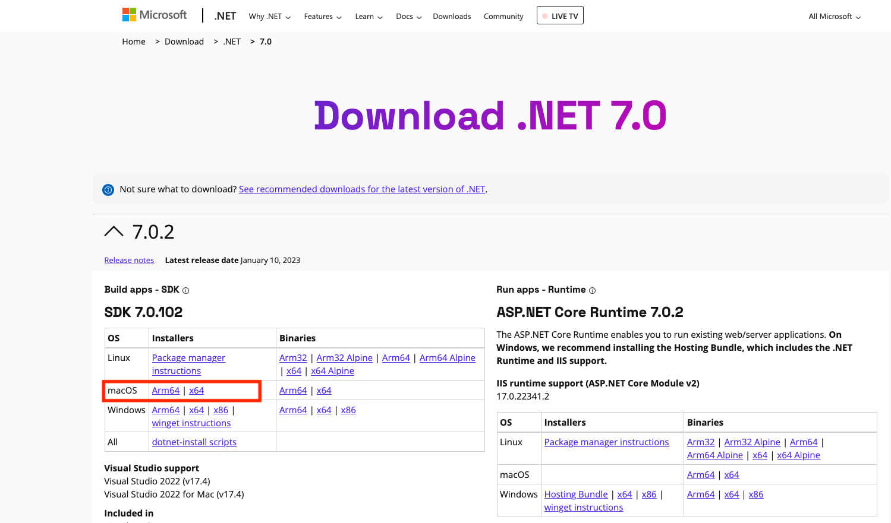

# Run .Net 7 code on Red Hat OpenShift Container Platform on Mac OS

Create a simple Hello World .Net 7 application and run it on a local instance of Red Hat OpenShift AKA OpenShift Local. See how easy it is to get started with development on OpenShift Container Platform (OCP). OCP supports many languages and you can easily bring your .Net code to the world of containers and Kubernetes with OCP.

Updated 19 January 2023

### Pre-req .Net 7 SDK
- Note: I'm using a Mac for this example.
- Download and install [.Net 7 SDK](https://dotnet.microsoft.com/en-us/download/dotnet/7.0) for your OS.
- Note: For this tutorial I used Microsoft's installation package for SDK 7.0.102



Install the .Net SDK per the instructions for your OS and test your .Net SDK installation

```
% dotnet --version
7.0.102
```

## Install Red Hat OpenShift Local
For this next step you will need a Red Hat account.

Download the Red Hat OpenShift Local (RHOL) for you OS from the Red Hat Hybrid Cloud Console [Create an OpenShift cluster](https://console.redhat.com/openshift/create/local) 

Chose the "local" tab and select your OS.

After you download CRC, click the Download pull secret


After you download the code run the installer.  The latest release of RHOL takes care of installing RHOL for you.

## Prep your CodeReady Containers environment
After installing RHOL, we will do the rest of the work on the command line.  On the Mac open a Terminal window.  I placed the pull secret in my home Documents folder in a folder I labeled rhol.  On the Mac or Linux it might look like this: ~/Documents/rhol

```
% mv pull-secret ~/Documents/rhol/
```

Check the RHOL version.  Note that RHOL still uses the previous Code Ready Containers acronym - crc.  As of 01/19/2023 the latest release RHOL is 2.12 with OpenShift 4.11.18

```
% crc version
CRC version: 2.12.0+ea98bb41
OpenShift version: 4.11.18
Podman version: 4.2.0
```      
Run the setup command to download the RHOL bundle and prep your environment. This typically takes a few mintues.
```      
% crc setup
RHOL is constantly improving and we would like to know more about usage (more details at https://developers.redhat.com/article/tool-data-collection)
...
Your system is correctly setup for using CRC. Use 'crc start' to start the instance
 ```
        
## Start up Red Hat OpenShift Local
Start up RHOL an include the pull secret you previously downloaded

```
% crc start -p ~/Documents/rhol/pull-secret
INFO Checking if running as non-root              
INFO Checking if crc-admin-helper executable is cached 
...

````

Depending on your hardware, it make several minutes for RHOL to startup.  Be sure to copy the login information that is displayed in the terminal after starting RHOL.  See example output below.

```
...
INFO Adding crc-admin and crc-developer contexts to kubeconfig... 
Started the OpenShift cluster.

The server is accessible via web console at:
  https://console-openshift-console.apps-crc.testing

Log in as administrator:
  Username: kubeadmin
  Password: zXje7-...-6aUho

Log in as user:
  Username: developer
  Password: developer

Use the 'oc' command line interface:
  $ eval $(crc oc-env)
  $ oc login -u developer https://api.crc.testing:6443
```

We can test our login to RHOL with the information from the installation.  We use the oc login command provide the userid and passward along with the URL to the RHOL Server.
```
% eval $(crc oc-env)
% oc login -u kubeadmin -p zXje7-...-6aUho https://api.crc.testing:6443
Login successful.

You have access to 67 projects, the list has been suppressed. You can list all projects with 'oc projects'

Using project "default".
```
## Create a sample Hello World .Net web app
Now let's create our sample .Net application.  Choose a directory where you would like to store your sample appication.  I created my sample Hello World .Net web app in a directory called projects.  We will use the .Net Model-View-Controller (mvc) template to build our sample .Net application.

```
% dotnet new mvc -o myWebApp --no-https
```

When the sample app code has finished generating change into the applicaiton's directory and start up the applicaiton.

```
% cd myWebApp
% dotnet run
Building...
...
info: Microsoft.Hosting.Lifetime[0]
      Content root path: /Users/palucas/projects/myWebApp
```
       
The app starts up quickly and is ready to test when **Content root path:...** printed to the terminal screen.  Follow the instructions to access the application via a browser.

The URL for my sample app was found on this line in the terminal output
```
Now listening on: http://localhost:5206
```


When you are finished return to the terminal window and type Ctrl-c to stop the .Net test server.

## Prep app for OpenShift Container Platform (RHOL)

I  refer to Red Hat OpenShift Locat as OpenShift Container platform (OCP) for the following steps.  Use the following command to make the .Net app ready for the OCP build and deploy process. The dotnet publish command preps the applicaiton for deployment storing the .Net artifacts in a release folder.  The -f swith sets the framework to .Net 7.0 and -c switch defines the build configuration

```
% cd ..
% dotnet publish myWebApp -f net7.0 -c Release
MSBuild version 17.4.1+9a89d02ff for .NET
  Determining projects to restore...
  All projects are up-to-date for restore.
  myWebApp -> /Users/palucas/projects/myWebApp/bin/Release/net7.0/myWebApp.dll
  myWebApp -> /Users/palucas/projects/myWebApp/bin/Release/net7.0/publish/
```
## Prep OCP for .Net
Login to OCP as developer
```
% eval $(crc oc-env)
% oc login -u developer -p developer https://api.crc.testing:6443
Login successful.

You don't have any projects. You can try to create a new project, by running

    oc new-project <projectname>


```

To see who you are logged in as type the following
```
% oc whoami
developer
```      

Create a new OCP project (K8s namespace) for our .Net Welcome application.
```
% oc new-project my-first-app
Now using project "my-first-app" on server "https://api.crc.testing:6443".

You can add applications to this project with the 'new-app' command. For example, try:

    oc new-app rails-postgresql-example

to build a new example application in Ruby. Or use kubectl to deploy a simple Kubernetes application:

    kubectl create deployment hello-node --image=k8s.gcr.io/e2e-test-images/agnhost:2.33 -- /agnhost serve-hostname
```      

You can check the project you are currently in with the following oc command:
```
% oc get projects
NAME           DISPLAY NAME   STATUS
my-first-app                  Active
```

If this is your first .Net project in RHOL, then you'll need to add a .Net image stream.  Image streams makes it easy to build and deploy our .Net app in a container and can be used to trigger new deployments when a new image becomes available   See links below for more informaton on Imagestreams
 ```
% oc create -f https://raw.githubusercontent.com/redhat-developer/s2i-dotnetcore/master/dotnet_imagestreams.json
imagestream.image.openshift.io/dotnet created
imagestream.image.openshift.io/dotnet-runtime created
```      

## Build, Deploy and access your new .Net app

Create a new build configuration.  We will use a Red Hat Universal Base Image (ubi8) that includes the .Net 7 SDK and runtimes.  UBI containers are OCI-compliant.  We are building the app from binary contents.  
```
% oc new-build --name=my-web-app dotnet:7.0-ubi8 --binary=true
warning: Cannot check if git requires authentication.
--> Found image 3aceb77 (8 days old) in image stream "my-first-app/dotnet" under tag "7.0-ubi8" for "dotnet:7.0-ubi8"

    .NET 7 
    ------ 
    Platform for building and running .NET 7 applications

    Tags: builder, .net, dotnet, dotnetcore, dotnet-70

    * A source build using binary input will be created
      * The resulting image will be pushed to image stream tag "my-web-app:latest"
      * A binary build was created, use 'oc start-build --from-dir' to trigger a new build

--> Creating resources with label build=my-web-app ...
    imagestream.image.openshift.io "my-web-app" created
    buildconfig.build.openshift.io "my-web-app" created
--> Success

```
      
Start the build and specify the path to the binary artifacts in .Net project (I'm at the "root" of my project folder myWebApp).
```
oc start-build my-web-app --from-dir=bin/Release/net7.0/publish
Uploading directory "bin/Release/net7.0/publish" as binary input for the build ...
....
Uploading finished
build.build.openshift.io/my-web-app-1 started
```
      
You can also check status of the build process in the log file to see when the build is completed. 
```
% oc logs -f bc/my-web-app
Receiving source from STDIN as archive ...
...
Push successful
```
      
Create our new application on OCP.
```
% oc new-app my-web-app
--> Found image fb95e95 (About a minute old) in image stream "my-first-app/my-web-app" under tag "latest" for "my-web-app"

    .NET 7 
    ------ 
    Platform for building and running .NET 7 applications

    Tags: builder, .net, dotnet, dotnetcore, dotnet-70


--> Creating resources ...
Warning: would violate PodSecurity "restricted:v1.24": allowPrivilegeEscalation != false (container "my-web-app" must set securityContext.allowPrivilegeEscalation=false), unrestricted capabilities (container "my-web-app" must set securityContext.capabilities.drop=["ALL"]), runAsNonRoot != true (pod or container "my-web-app" must set securityContext.runAsNonRoot=true), seccompProfile (pod or container "my-web-app" must set securityContext.seccompProfile.type to "RuntimeDefault" or "Localhost")
    deployment.apps "my-web-app" created
    service "my-web-app" created
--> Success
    Application is not exposed. You can expose services to the outside world by executing one or more of the commands below:
     'oc expose service/my-web-app' 
    Run 'oc status' to view your app.
```

You can check the status of your app deployment.
``` 
% oc status
In project my-first-app on server https://api.crc.testing:6443

svc/my-web-app - 10.217.5.240:8080
  deployment/my-web-app deploys istag/my-web-app:latest <-
    bc/my-web-app source builds uploaded code on istag/dotnet:7.0-ubi8 
    deployment #2 running for 49 seconds - 1 pod
    deployment #1 deployed 51 seconds ago


1 info identified, use 'oc status --suggest' to see details.
```

We can see that the... service is create with appplication deployment
```
% oc get svc
NAME         TYPE        CLUSTER-IP     EXTERNAL-IP   PORT(S)    AGE
my-web-app   ClusterIP   10.217.5.240   <none>        8080/TCP   105s
```

Let's expose the app to the world be creating a route to the app.
```
% oc expose svc/my-web-app
route.route.openshift.io/my-web-app exposed
```

Let's see the rouute we just created
```
% oc get route/my-web-app
NAME         HOST/PORT                                  PATH   SERVICES     PORT       TERMINATION   WILDCARD
my-web-app   my-web-app-my-first-app.apps-crc.testing          my-web-app   8080-tcp                 None
```

Let's get the url to the app
```
% oc status
In project my-first-app on server https://api.crc.testing:6443

http://my-web-app-my-first-app.apps-crc.testing to pod port 8080-tcp (svc/my-web-app)
  deployment/my-web-app deploys istag/my-web-app:latest <-
    bc/my-web-app source builds uploaded code on istag/dotnet:7.0-ubi8 
    deployment #2 running for 17 hours - 1 pod
    deployment #1 deployed 17 hours ago


1 info identified, use 'oc status --suggest' to see details.
```

Go to your web browser and type in the url http://my-web-app-my-first-app.apps-crc.testing to see your app running in OCP.


Back at the command we can examine some components running on OCP.  Let's look at what pods are in our project.
```
% oc get pods
NAME                         READY   STATUS      RESTARTS   AGE
my-web-app-1-build           0/1     Completed   0          10m
my-web-app-ddfbd687b-9h5tf   1/1     Running     0          7m43s
```

And we can see our deployments in our project
```
% oc get deployments
NAME         READY   UP-TO-DATE   AVAILABLE   AGE
my-web-app   1/1     1            1           8m4s
```

## Access the OCP console to see your project and app

Let's take a look at the OCP Console 
```
% crc console
Opening the OpenShift Web Console in the default browser...
```

The crc console commands launches the console in your default browser.  Typically the URL looks like https://console-openshift-console.apps-crc.testing/  Your browser will tell you that your connection is not private as the OCP TLS certificate is not installed with your broswer certificates.  Accept any certificates presented to you.


Enter your Username and Password, and click the blue Login button.


When logging into the OCP console for the first time, you may offered to take a tour of the console.  Feel free to take the tour or skip it.

Currenlty we are logged in as the developer username with the Developer view of the OCP Console.  Click on the Topology tab on the side menu bar to to see the topolog of our application.  We can see our app has successfully deployed with the green check circle.  On the upper right we click the arrow to open application UI in a new browser tab.  If we click the app name a side screen will open with additional application deployment details


We can view Details, Resources and Observe (monitor) our application. Clicking on the Resources tab shows us the Kubernetes object associated with our project.


While logged in as the developer we can change the console view from the Developer view to the Adminstrator view.  We can create, review and observe our all the Kubernetes objecst that make up our application(s) running in OpenShift.  


## Updating the Application
Let's make a simple change to our application and then update it on OCP.

Let's change the "Welcome" message to "Welcome from OpenShift Container Platform!".


Back af the folder containing your .Net project, navigate to the Home directory under your project.

```
% cd ~/projects/myWebApp/Views/Home
 ```

In the Home directory open the file titled Index.cshtml with your favorite editor. 
```
% vi Index.cshtml
```
      
Change the following line:
```
<h1 class="display-4">Welcome</h1>
```      

to:
```
<h1 class="display-4">Welcome to .Net running on Red Hat OpenShift Container</h1>
```

My file looked like this...
```
@{
    ViewData["Title"] = "Home Page";
}

<div class="text-center">
    <h1 class="display-4">Welcome to .Net running on Red Hat OpenShift Container</h1>
    <p>Learn about <a href="https://docs.microsoft.com/aspnet/core">building Web apps with ASP.NET Core</a>.</p>
</div>
```
      
Let's test our change locally in .Net.  Go back to the "root" of your project folder and rerun the application to see the changed message
```
% cd ~/projects/myWebApp 
% dotnet run
``` 


From the projects directory rebuild the changed .Net artifacts
```
% dotnet publish myWebApp -f net7.0 -c Release
MSBuild version 17.4.1+9a89d02ff for .NET
  Determining projects to restore...
  All projects are up-to-date for restore.
  myWebApp -> /Users/palucas/projects/myWebApp/bin/Release/net7.0/myWebApp.dll
  myWebApp -> /Users/palucas/projects/myWebApp/bin/Release/net7.0/publish/
```

Let's deploy update application to OCP

Make sure you are logged in to OCP
Login to OCP as developer.  Make sure you see that you are using the same project we originally created for our first application.
```
% eval $(crc oc-env)
% % oc login -u developer -p developer https://api.crc.testing:6443
Login successful.

You have one project on this server: "my-first-app"

Using project "my-first-app".
```

Rebuild the applciation
```
% oc start-build my-web-app --from-dir=bin/Release/net7.0/publish
Uploading directory "bin/Release/net7.0/publish" as binary input for the build ...
.
Uploading finished
build.build.openshift.io/my-web-app-2 started
```

Let's check the status of the build process of our updated application.
```
% oc status
In project my-first-app on server https://api.crc.testing:6443

http://my-web-app-my-first-app.apps-crc.testing to pod port 8080-tcp (svc/my-web-app)
  deployment/my-web-app deploys istag/my-web-app:latest <-
    bc/my-web-app source builds uploaded code on istag/dotnet:7.0-ubi8 
      build #2 running for 17 seconds
      build #1 succeeded 19 hours ago
    deployment #2 running for 19 hours - 1 pod
    deployment #1 deployed 19 hours ago


1 info identified, use 'oc status --suggest' to see details.
```

Let's check log file of the build configuration to see when it finishes.  Watch for the 'Push successful' message.
```
oc logs -f bc/my-web-app 
Receiving source from STDIN as archive ...
...
Push successful

```

If you forgot the URL to our sample application, use the oc status command to get the URL
```
oc status
In project my-first-app on server https://api.crc.testing:6443

http://my-web-app-my-first-app.apps-crc.testing to pod port 8080-tcp (svc/my-web-app)
...
```

You'll now see the new version of our applcation has been deployed to OCP


Go back to the OCP console and change to the Administrator view.  We can see the new build config under the Workloads section, and the new Pod instance for our application


### Conclusion
From this brief tutorial we can see how easy it is to bring our .Net applications in to a modern enterprise ready kubernetes platform like OpenShift.  OpenShift can run anywhere from the desktop to the datacenter to the public cloud in any hybrid combination.  OCP is flexible enough to
integrate OCP into your .Net CI/CD pipeline using tools like Visual Code and GitLab to make for a fast and efficient enterprise software lifecycle environment.

## References
- [Product Documentation for Red Hat OpenShift Local 2.12](https://access.redhat.com/documentation/en-us/red_hat_openshift_local/2.12)
- [Product Documentation for .NET 7.0](https://access.redhat.com/documentation/en-us/net/7.0)
- [Managing Imagestreams OCP 4.11](https://docs.openshift.com/container-platform/4.11/openshift_images/image-streams-manage.html)

